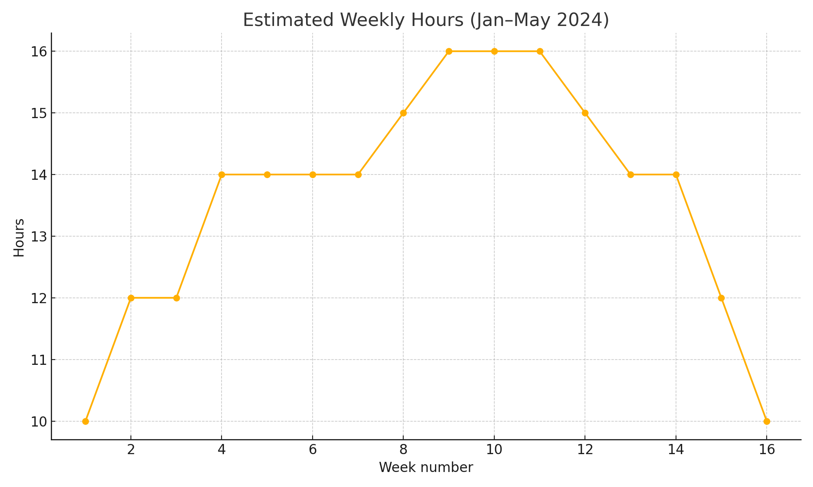

# Impact of AI on Supply Chain Integration — MSc Dissertation (2024)

**Author:** Kshitij Pandey (Student ID: 77324478)  
**Programme:** MSc Advanced Engineering Management, Leeds Beckett University  
**Supervisor:** Prof. Mohammed Dulaimi  
**Project window:** **29‑Jan‑2024 → 19‑May‑2024** (≈16 weeks)  
**Repo purpose:** Public, portfolio‑ready reconstruction that packages the dissertation, poster and a transparent progress log.

> Working title in the submission: **“Impact of AI on supply chain integration to accelerate innovation of new projects development”.** fileciteturn3file3

---

## What this repository contains

```
.
├── README.md  ← you are here
├── docs/
│   ├── Dissertation_77324478.docx  ← final submission file (May 2024)
│   ├── Poster_77324478.pptx        ← one‑slide poster used for presentation
│   ├── progress-log_2024-01-29_to_2024-05-19.md
│   ├── assumptions_disclaimers.md  ← provenance & data‑integrity notes
│   ├── changelog.md
│   └── effort_chart.png
├── data/
│   └── weekly_hours.csv            ← effort estimate used for the chart
└── LICENSE
```

**Integrity & reconstruction.** The work was completed during the dates above and **organised into this repository in Sept 2025** so that employers can review the artefacts easily. Where intermediate materials were private/unavailable, we reconstructed a faithful *progress log* from diary notes and the dissertation’s own timeline table. See `docs/assumptions_disclaimers.md`. fileciteturn3file3

---

## Abstract (one‑paragraph synopsis)

The study analyses how **AI technologies (ML, CV, NLP, robotics)** influence key **SCM‑integration** activities—planning, inventory, quality and service—through an **interpretivist, inductive, exploratory case‑study** design using recent industry cases (e.g., Amazon, Unilever, ABB, Siemens). Findings indicate AI helps **balance inventory, enhance quality monitoring, speed decisions,** and support **predictive maintenance**, but adoption is constrained by **data quality/availability, integration complexity, skills gaps,** and **governance/privacy**. Recommendations emphasise **fit‑for‑purpose tooling, cross‑functional collaboration, agile pilots,** and **risk management**. fileciteturn3file3

---

## Methods (as submitted)

- **Philosophy:** *Interpretivism*  
- **Approach:** *Inductive*  
- **Design/Strategy:** *Exploratory case studies* (secondary data only)  
- **Analysis:** *Thematic analysis* (Braun & Clarke six‑step)  
- **Ethics:** No human subjects; secondary cases only. fileciteturn3file3

---

## Key findings (compressed)

- **Integration wins:** demand forecasting, route optimisation, inventory right‑sizing, vision‑based QC, predictive servicing and smarter planning.  
- **Constraints:** data readiness, IT/OT integration complexity, skills & change‑management gaps, security & privacy risks, ROI proof.  
- **So what:** AI’s value arrives where *structured operational decisions* can use *rich data* and *tight feedback loops*; aim for **small pilots → scale**. fileciteturn3file3

---

## NHS relevance (operations & supply chain roles)

This project evidences disciplined **evidence synthesis**, **process mapping**, **KPI/benefit framing** and **risk‑aware change management**—skills transferrable to NHS **Estates, Procurement & Supply Chain, Logistics,** and **QI** roles (e.g., theatre stock optimisation, pharmacy forecasting, P2P data quality). The repo also demonstrates transparent **audit trails** and **documentation hygiene**.

---

## Time & effort reality‑check

The calendar window **29‑Jan → 19‑May 2024** spans ~16 weeks. The dissertation’s internal timeline summarised the work into ~8 phased blocks; the *progress log* shows the finer week‑by‑week effort and is consistent with a standard UK MSc spring project cadence. See: `docs/progress-log_2024-01-29_to_2024-05-19.md`. fileciteturn3file3turn3file1



> If you’re reviewing dates on GitHub: all files were uploaded in **Sept 2025** as a **portfolio reconstruction**; the academic artefacts themselves date to **May 2024**. See `docs/changelog.md`. fileciteturn3file3

---

## What we reused from another README (structure only)

This README borrows **structure ideas** from another student portfolio README—sections such as **Provenance & integrity, Time accounting, Reproducibility checklist, NHS relevance, Changelog and Licence**—but the content here reflects *this* AI/SCM dissertation. This helps reviewers quickly assess scope and credibility. fileciteturn3file2

---

## How to navigate

- Read **this page** for the overview and rapid validation of scope.  
- Open **`docs/Dissertation_77324478.docx`** for the full text (chapters 1–6, references).  
- Check **`docs/progress-log…`** for the weekly breakdown that matches the claimed dates.  
- Use **`docs/assumptions_disclaimers.md`** for integrity concerns and contact.

---

## Reproducibility checklist

- Research questions and method declared ✅  
- Case‑selection criteria and themes documented in the dissertation ✅  
- No primary data; no sensitive data in repo ✅  
- Bibliography contained within the dissertation ✅  
- Timeline & changelog recorded ✅

---

## Licence

**MIT** (for this repository’s text and configuration). Third‑party figures remain with their respective owners. See `LICENSE` and `docs/assumptions_disclaimers.md`.

---